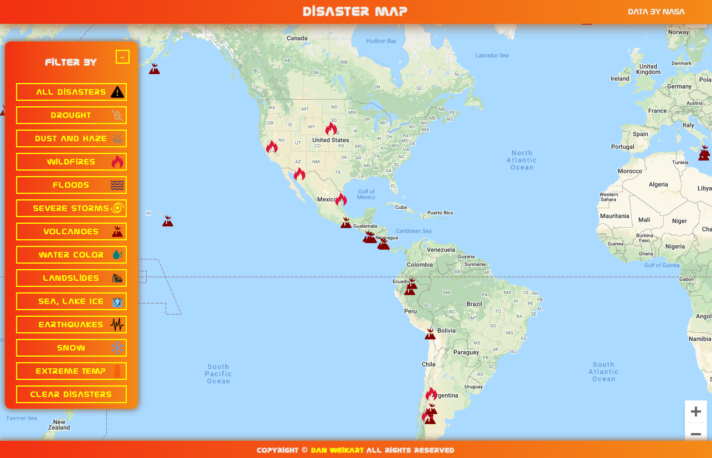

# Disaster Map

World map of current natural disasters using NASA's EONET API.

Deployed: https://thedanitor.github.io/disaster_map/

## Table of Contents

* [Description](#description)
* [Technologies Used](#technologies)
* [Usage](#usage)
* [Acknowledgements](#acknowledgements)

## Description

What started out as a fire tracker app turned into a map of all current disasters from the EONET API. Users can browse the map to view disasters all over the globe. Disasters can be filtered by type as well.

## Technologies

* React
* JavaScript
* CSS
* HTML
* NASA EONET API
* Iconify

## Usage

Go to https://thedanitor.github.io/disaster_map/ in your browser and wait for the map to load.\
Drag the map and zoom out to move to different parts of the world.\
Hover over an icon to see the name and location of the disaster.\
Click on the icon for more information and click the Find Out More button to be taken to an external site with more information.\
Click on a disaster type in the filter box to see disasters of that type.\

## Acknowledgements

I would like to give credit to Brad Traversy for getting me started with this project as well as NASA for their free APIs.

